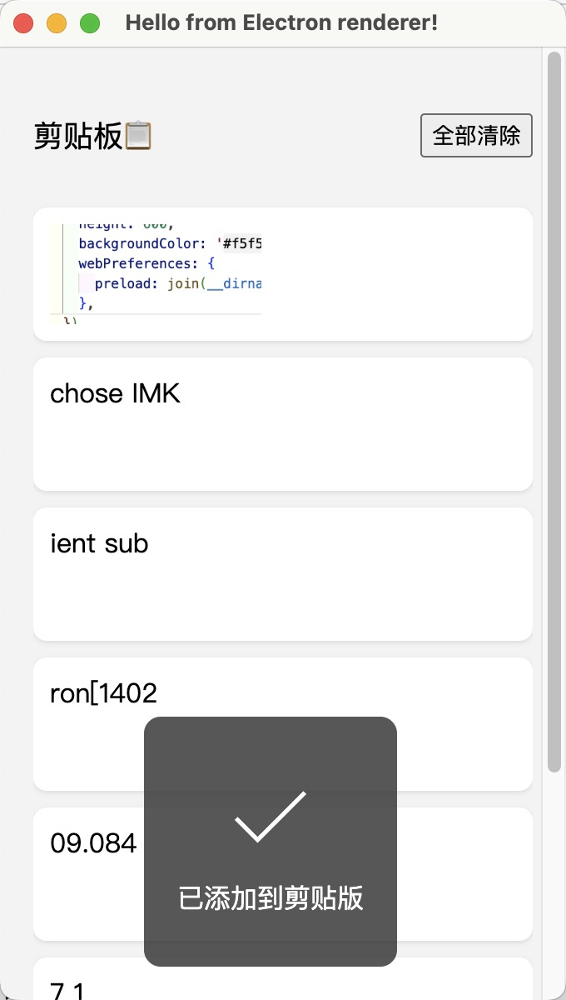

使用了electron，监控剪贴板的历史数据，包括文本和图片。

1. 使用setInterval监控剪贴板的变化

2. 历史数据放在了localstorage中最多10条。

3. 快捷键唤起：shift+cmd+v

4. 复制的图片保存在临时目录中，一个小时后清除

5. 一键清空历史记录并且清空剪贴板

6. 点击历史数据还原到剪贴板中，会有toast提醒

npm install 安装

npm start 启动

npm run make 打包

todo：

 1. 使用 clipboard-watcher 替代轮询
 
 2. 图片过期，缓存中读取不到图片，过期删除缓存中的图片
    
 3. 打包测试估计有问题
 
 

 
 
